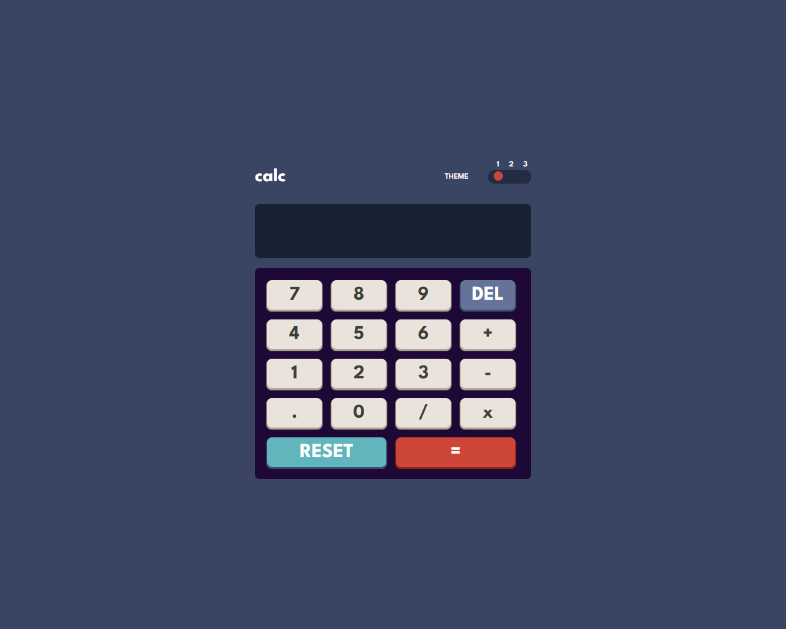
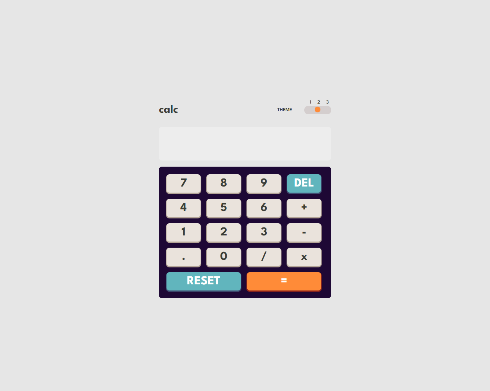
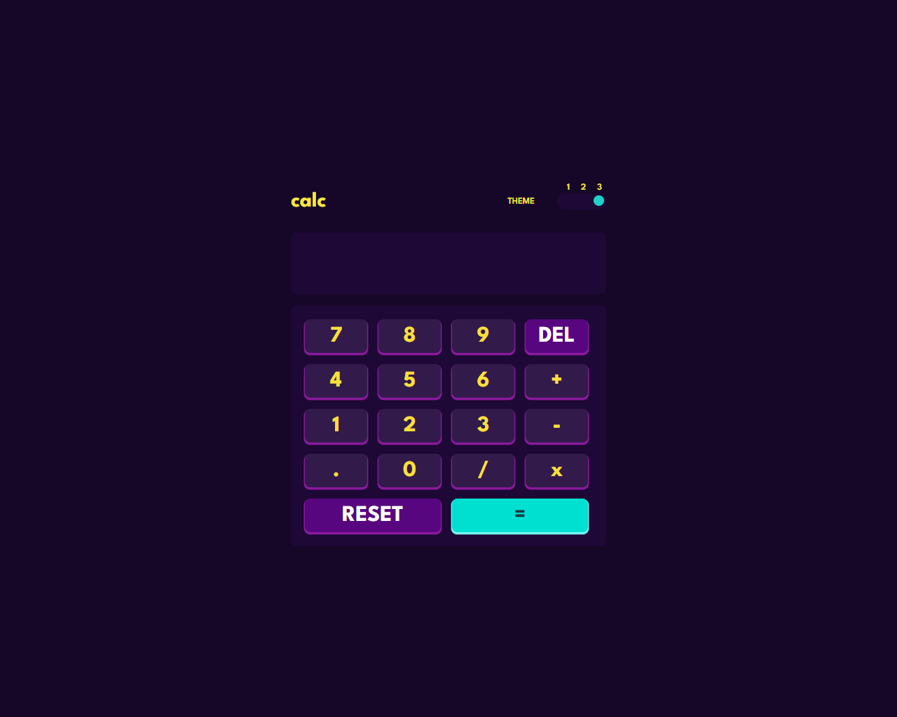
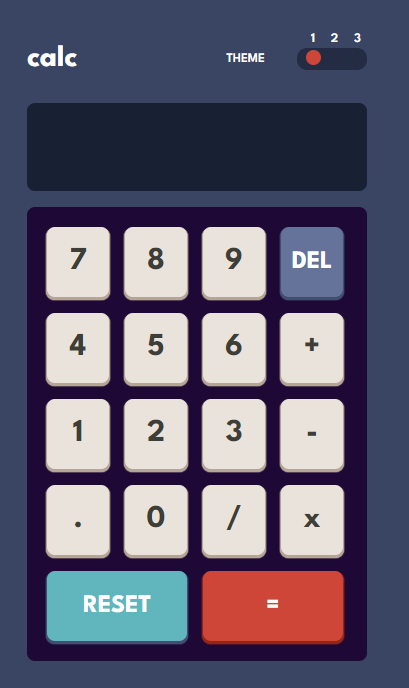
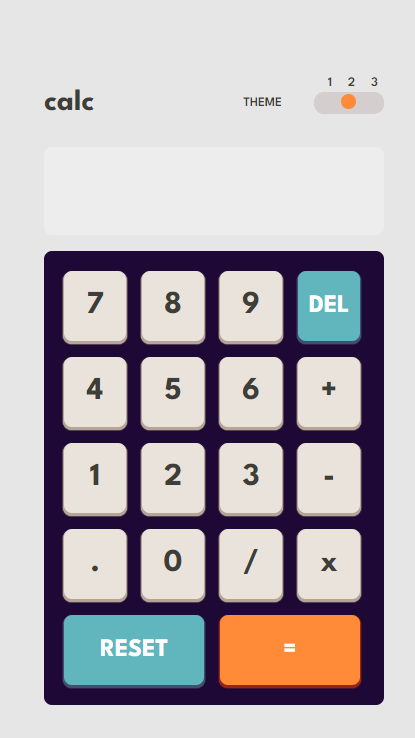
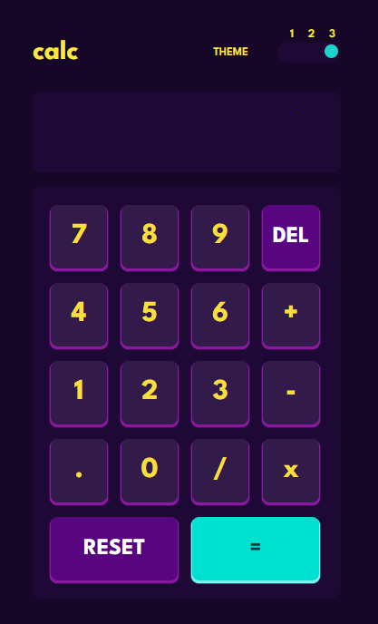

  Calculator app solution

This is a solution to the [Calculator app challenge on Frontend Mentor](https://www.frontendmentor.io/challenges/calculator-app-9lteq5N29). Frontend Mentor challenges help you improve your coding skills by building realistic projects. 

## Table of contents

- [Overview](#overview)
  - [The challenge](#the-challenge)
  - [Screenshot](#screenshot)
  - [Links](#links)
- [My process](#my-process)
  - [Built with](#built-with)
  - [What I learned](#what-i-learned)
  - [Continued development](#continued-development)
  - [Useful resources](#useful-resources)
- [Author](#author)

## Overview

### The challenge

Users should be able to:

- See the size of the elements adjust based on their device's screen size
- Perform mathmatical operations like addition, subtraction, multiplication, and division
- Adjust the color theme based on their preference
- **Bonus**: Have their initial theme preference checked using `prefers-color-scheme` and have any additional changes saved in the browser

### Screenshot

#### Desktop

#### Mobile

### Links

- Live Site URL: [Add live site URL here](https://faisal786111.github.io/Calculator-app/)

## My process

### Built with

- Semantic HTML5 markup
- CSS custom properties
- Flexbox
- CSS Grid
- Mobile-first workflow

### What I learned

I learned new techniques while creating a web calculator application, such as changing the body themes using toggles. I also gained knowledge on making websites more responsive through media queries. Additionally, I learned how to organize code effectively.

### Continued development

For continued development, I aim to focus on further refining my skills in web development, particularly in creating more complex and feature-rich applications. Additionally, I plan to deepen my understanding of Data Structures and Algorithms (DSA), as they are fundamental to efficient programming and problem-solving. By exploring these areas in future projects, I aim to enhance my proficiency and build a strong foundation for creating robust and scalable web solutions.

### Useful resources

- [MS Powertoys](https://learn.microsoft.com/en-us/windows/powertoys/) - This helped me for picking the colors which I want. 

## Author

- Website - [Faisal Khan](https://faisal786111.github.io/Calculator-app/)
- Frontend Mentor - [@Faisal786111](https://www.frontendmentor.io/profile/Faisal786111)
